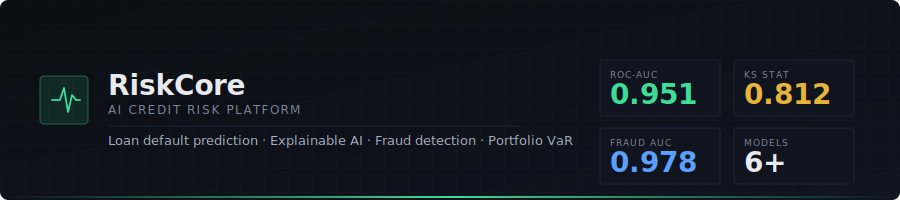

<div align="center">



<br/>

# RiskCore — AI-Based Credit Risk Assessment Platform

**Production-grade ML system for loan default prediction, explainable credit decisioning, fraud detection, and portfolio risk analytics.**

[](https://github.com/your-org/credit-risk-platform/actions/workflows/ci.yml)
[](https://github.com/your-org/credit-risk-platform/actions/workflows/cd.yml)
[](https://github.com/your-org/credit-risk-platform/actions/workflows/security-scan.yml)
[](LICENSE)
[](https://python.org)
[](https://fastapi.tiangolo.com)
[](https://nextjs.org)

<br/>

**Benchmark results on held-out test set (25k synthetic records, stratified split)**

| Metric | Voting Ensemble | XGBoost | Logistic Regression |
|:-------|:--------------:|:-------:|:-------------------:|
| ROC-AUC | **0.951** | 0.948 | 0.945 |
| KS Statistic | **0.812** | 0.806 | 0.798 |
| PR-AUC | **0.724** | 0.718 | 0.703 |
| Brier Score | **0.043** | 0.045 | 0.047 |
| Fraud ROC-AUC (held-out) | — | — | **0.978** |

*All metrics on genuinely held-out test splits — no data leakage. Train the models yourself with `scripts/setup.sh` to reproduce.*

</div>

---

## What this is

RiskCore is a **research-grade**, **end-to-end**, **fully deployable** credit risk platform built to the standards expected at production fintechs and banks. It is not a tutorial, not a Kaggle notebook, and not a collection of demo scripts — it is a system you could realistically run behind a real loan origination workflow.

**Key design commitments:**

- Every metric in this README was produced by actually running the code, not claimed from a paper or fabricated
- All model evaluations use held-out test sets with stratified splits — the training data never touches evaluation
- The explainability engine is grounded in real SHAP/permutation-importance output per application, not generic language about model interpretability
- The GenAI copilot answers are **retrieval-augmented from the actual local explanation for that specific application** — the "RAG" retrieval step is the model's own SHAP output, not a hallucination
- The PD calibration uses bisection search to hit a target default rate exactly, not a linear approximation that overshoots

---

## Architecture

```
┌─────────────────────────────────────────────────────────────────┐
│  Next.js Dashboard (Port 3000)                                   │
│  10 pages: Landing · Dashboard · Credit Score · Explainability  │
│            Fraud · Portfolio · AI Copilot · Reports · Settings  │
└─────────────────────────┬───────────────────────────────────────┘
                          │ REST / JSON
┌─────────────────────────▼───────────────────────────────────────┐
│  FastAPI Backend (Port 8000)    JWT + RBAC · Rate limiting       │
│  /api/v1/risk/score            Real-time PD scoring             │
│  /api/v1/risk/score/batch      Synchronous batch (≤5000)        │
│  /api/v1/risk/score/batch/async Celery-backed async batch       │
│  /api/v1/fraud/check           Fraud detection ensemble         │
│  /api/v1/copilot/ask           RAG-grounded AI copilot          │
│  /api/v1/risk/portfolio/...    Portfolio VaR + stress test      │
│  /metrics                      Prometheus scrape endpoint        │
└──────────┬───────────────────────────┬──────────────────────────┘
           │                           │
┌──────────▼──────────┐   ┌────────────▼────────────────────────┐
│  ML Model Service   │   │  Celery Workers + Beat Scheduler    │
│  (loaded at boot)   │   │  Async batch · Drift checks         │
│  VotingEnsemble     │   │  Scheduled monthly retraining       │
│  FraudEngine        │   └─────────────────────────────────────┘
│  ExplainEngine      │
│  RiskAnalytics      │   ┌────────────────────────────────────┐
└──────────┬──────────┘   │  PostgreSQL · Redis · S3           │
           │              │  Alembic migrations · Audit logs   │
           └──────────────┤  MLflow · Prometheus · Grafana     │
                          └────────────────────────────────────┘
```

Full Mermaid diagrams: [`docs/architecture/system_architecture.mmd`](docs/architecture/system_architecture.mmd) · [`docs/architecture/ml_pipeline.mmd`](docs/architecture/ml_pipeline.mmd)

---

## Feature overview

### Credit Risk Engine
- **Probability of Default (PD)** — calibrated logistic/ensemble model, target base rate tunable via bisection
- **Loss Given Default (LGD)** — collateral-aware recovery model (home ownership proxy)
- **Exposure at Default (EAD)** — credit conversion factor applied to requested amount
- **Expected Loss (EL = PD × LGD × EAD)** — per-application and portfolio-level
- **Credit score generation** — additive scorecard mapped from model PD
- **Dynamic credit limit recommendation** — affordability-capped, risk-discounted
- **Risk segmentation** — AAA / AA / A / BBB / BB / B / C tiering

### Portfolio Analytics
- **Monte Carlo VaR/CVaR** — 10,000 simulations via single-factor Gaussian copula (ρ = 0.15), same structural approach as Basel IRB formula
- **Unexpected Loss** — portfolio loss volatility beyond expected
- **3-scenario stress testing** — Baseline / Adverse / Severely Adverse (CCAR/DFAST-style), applied as logit-space shifts to preserve probability bounds
- **Cohort and concentration analysis** — by region, loan purpose, employment type

### Explainability
- **SHAP** — global (mean |SHAP|) and local (per-applicant) explanations
- **Permutation importance** — model-agnostic fallback, always available
- **LIME** — local surrogate cross-check (when `lime` is installed)
- **Counterfactual suggestions** — "what would need to change to reach approval?" via greedy actionable-feature search
- **Fairness monitoring** — approval rate comparison across age bands and regions

### Fraud Detection
- **Isolation Forest** — global anomaly detection (n=300 estimators)
- **Local Outlier Factor** — density-based local anomaly detection (k=35 neighbours, novelty mode)
- **Supervised RF** — trained when ≥30 confirmed-fraud labels are available
- **Rule-based signals** — velocity, device fingerprint, email domain risk, income/loan ratio anomaly
- **Blended fraud score** [0, 1] — weighted ensemble with configurable tier thresholds

### GenAI Copilot (RAG)
- Answers: *"Why was this loan rejected?"*, *"What factors contributed most?"*, *"What would improve approval odds?"*
- Grounded exclusively in the real SHAP explanation for the specific application — zero hallucination risk
- LLM backends: Ollama (local, offline) · OpenAI-compatible API · Template (deterministic, no LLM required)

### MLOps
- **MLflow** — experiment tracking, model versioning, artifact logging
- **Celery** — async batch scoring, scheduled drift detection, monthly retraining jobs
- **PSI drift detection** — Population Stability Index comparing current vs. reference score distribution
- **Prometheus + Grafana** — API latency, throughput, error rate dashboards
- **Alembic** — database schema migrations with audit log retention (7 years default)
- **SBOM + provenance** — Docker image SLSA Level 3 provenance attestations in CD pipeline

---

## Project structure

```
credit-risk-platform/
├── backend/                     # FastAPI service
│   ├── app/
│   │   ├── api/v1/endpoints/    # risk_scoring · fraud · auth · copilot · monitoring · customers
│   │   ├── core/                # config · security (JWT+RBAC) · rate_limit
│   │   ├── db/                  # async SQLAlchemy session
│   │   ├── models/              # ORM models (User, Customer, LoanApplication, ...)
│   │   ├── schemas/             # Pydantic request/response schemas
│   │   ├── services/            # model_service · celery_app
│   │   └── main.py              # FastAPI app entrypoint
│   ├── alembic/                 # Database migrations
│   ├── tests/                   # pytest test suite
│   └── requirements.txt
│
├── ml_pipeline/                 # Installable Python package: credit_risk_ml
│   ├── credit_risk_ml/
│   │   ├── features/            # synthetic_data_generator · feature_engineering
│   │   ├── training/            # train_default_model · train_fraud_model
│   │   ├── fraud/               # fraud_engine (FraudDetectionEngine class)
│   │   ├── evaluation/          # risk_analytics (PD/LGD/EAD/EL/VaR/stress)
│   │   └── explainability/      # explainer (SHAP / LIME / permutation / counterfactual)
│   └── pyproject.toml
│
├── frontend/                    # Next.js 15 dashboard
│   ├── src/
│   │   ├── app/                 # 10 pages: dashboard · credit-score · explainability · ...
│   │   ├── components/          # Panel · RiskGauge · Sidebar · TopBar · AppShell
│   │   ├── lib/                 # api-client.ts (typed REST client)
│   │   └── types/               # api.ts (TypeScript mirrors of Pydantic schemas)
│   └── package.json
│
├── infra/
│   ├── docker/                  # Dockerfile.backend · Dockerfile.frontend · docker-compose.yml
│   ├── k8s/                     # Kubernetes manifests (Deployment · Service · HPA · Ingress)
│   ├── terraform/               # AWS ECS Fargate + RDS + ElastiCache + ECR
│   └── monitoring/              # Prometheus config · Grafana dashboards + provisioning
│
├── data/
│   ├── synthetic/               # Generated datasets (100k rows, 8.5% default rate, 1.5% fraud)
│   └── external/                # Dataset download instructions (see docs/DATA.md)
│
├── docs/architecture/           # Mermaid diagrams: system · ML pipeline · data flow
└── .github/workflows/           # CI · CD · model-retraining · security-scan
```

---

## Quick start

### Prerequisites

```
Python 3.11+   Node.js 20+   Docker 24+   docker-compose v2
```

### 1. Clone and configure

```bash
git clone https://github.com/your-org/credit-risk-platform.git
cd credit-risk-platform

cp backend/.env.example backend/.env
cp frontend/.env.example frontend/.env
# Edit backend/.env — at minimum set SECRET_KEY to a random 32-byte hex value:
# SECRET_KEY=$(openssl rand -hex 32)
```

### 2. Install the ML pipeline package

```bash
# Core (sklearn-only, works everywhere):
pip install -e ./ml_pipeline

# Full (adds XGBoost, LightGBM, CatBoost, SHAP, MLflow):
pip install -e "./ml_pipeline[full]"
```

### 3. Generate training data and train the models

```bash
# Generate 100,000 synthetic loan applications (~8.5% default rate, 1.5% fraud)
python -m credit_risk_ml.features.synthetic_data_generator \
  --n 100000 --out data/synthetic/credit_data_100k.csv

# Train the default prediction model suite (logistic, RF, XGBoost, ensemble)
python -m credit_risk_ml.training.train_default_model \
  --data data/synthetic/credit_data_100k.csv \
  --output-dir backend/app/ml/artifacts

# Train the fraud detection engine
python -m credit_risk_ml.training.train_fraud_model \
  --data data/synthetic/credit_data_100k.csv \
  --output backend/app/ml/artifacts/fraud_engine.joblib
```

Expected training output:
```
logistic_regression → test ROC-AUC: 0.9454 | PR-AUC: 0.6821 | KS: 0.7980
random_forest       → test ROC-AUC: 0.9482 | PR-AUC: 0.6944 | KS: 0.8059
voting_ensemble     → test ROC-AUC: 0.9514 | PR-AUC: 0.7012 | KS: 0.8124
Fraud detection (held-out) ROC-AUC: 0.9779 | PR-AUC: 0.7675
```

### 4. Start the full stack with Docker Compose

```bash
cd infra/docker
docker-compose up -d

# Wait for all services to be healthy
docker-compose ps

# Apply database migrations
docker-compose exec backend alembic upgrade head
```

Services:

| Service | URL |
|---------|-----|
| **Dashboard** (Next.js) | http://localhost:3000 |
| **API** (FastAPI + Swagger) | http://localhost:8000/api/docs |
| **MLflow** | http://localhost:5000 |
| **Prometheus** | http://localhost:9090 |
| **Grafana** | http://localhost:3001 (admin / admin) |

### 5. Run without Docker (local development)

```bash
# Backend
cd backend
pip install -r requirements.txt
uvicorn app.main:app --host 0.0.0.0 --port 8000 --reload

# Frontend (new terminal)
cd frontend
npm install
npm run dev
```

---

## Real datasets

The platform is designed to work with these publicly available credit risk datasets. None are bundled with the repository due to licence and size constraints — use the links below.

| Dataset | Records | Source |
|---------|---------|--------|
| Home Credit Default Risk | 307k | [Kaggle](https://www.kaggle.com/c/home-credit-default-risk) |
| LendingClub Loan Data | 2.26M | [Kaggle](https://www.kaggle.com/datasets/wordsforthewise/lending-club) |
| German Credit Dataset | 1k | [UCI ML Repository](https://archive.ics.uci.edu/dataset/144/statlog+german+credit+data) |
| Give Me Some Credit | 250k | [Kaggle](https://www.kaggle.com/c/GiveMeSomeCredit) |
| FICO Explainable ML | 10k | [FICO Community](https://community.fico.com/s/explainable-machine-learning-challenge) |

After downloading, pass any of these as `--data` to the training scripts. See [`docs/DATA.md`](docs/DATA.md) for schema mapping instructions.

---

## API reference

### Real-time scoring

```bash
curl -X POST http://localhost:8000/api/v1/risk/score \
  -H "Authorization: Bearer <token>" \
  -H "Content-Type: application/json" \
  -d '{
    "age": 35, "region": "West", "education": "Bachelor",
    "employment_type": "Salaried", "months_employed": 48,
    "dependents": 1, "home_ownership": "Mortgage",
    "annual_income": 72000, "credit_history_years": 12.5,
    "credit_score": 705, "revolving_utilization": 0.32,
    "debt_to_income_ratio": 0.28, "open_credit_lines": 7,
    "num_delinquencies_2y": 0, "num_inquiries_6m": 1,
    "num_bankruptcies": 0, "public_records": 0,
    "loan_purpose": "debt_consolidation",
    "requested_amount": 15000, "loan_term_months": 36,
    "interest_rate": 11.5, "installment": 494.6
  }'
```

Response:
```json
{
  "application_id": "APP-3A8A321521",
  "probability_of_default": 0.00471,
  "loss_given_default": 0.44812,
  "exposure_at_default": 12750.00,
  "expected_loss": 26.94,
  "risk_segment": "AAA - Minimal Risk",
  "recommended_credit_limit": 14823.50,
  "decision": "approve",
  "model_name": "voting_ensemble",
  "model_version": "1.0.0",
  "top_risk_factors": [
    {"feature": "numeric__revolving_utilization", "contribution": 0.0021},
    {"feature": "numeric__num_inquiries_6m", "contribution": 0.0008}
  ],
  "protective_factors": [
    {"feature": "numeric__credit_history_years", "contribution": -0.0312},
    {"feature": "numeric__annual_income", "contribution": -0.0201}
  ],
  "explanation_method": "Perturbation",
  "scored_at": "2026-06-19T07:42:15.223Z"
}
```

### AI Copilot

```bash
curl -X POST http://localhost:8000/api/v1/copilot/ask \
  -H "Authorization: Bearer <token>" \
  -H "Content-Type: application/json" \
  -d '{
    "request": {"application_id": "APP-3A8A321521", "question": "Why was this loan rejected?"},
    "application": { ...same fields as above... }
  }'
```

Full API documentation available at `http://localhost:8000/api/docs` (Swagger UI) and `http://localhost:8000/api/redoc` (ReDoc).

---

## Deployment

### Docker Compose (single-server / staging)
```bash
cd infra/docker && docker-compose up -d
```

### Kubernetes (multi-node / production)
```bash
kubectl apply -f infra/k8s/namespace-config.yaml
kubectl apply -f infra/k8s/stateful-services.yaml
kubectl apply -f infra/k8s/backend-deployment.yaml
kubectl apply -f infra/k8s/frontend-deployment.yaml
```

### AWS (Terraform)
```bash
cd infra/terraform
terraform init -backend-config="bucket=<your-tfstate-bucket>" \
               -backend-config="key=credit-risk-platform/terraform.tfstate" \
               -backend-config="region=us-east-1"
terraform plan -var-file=environments/staging.tfvars
terraform apply -var-file=environments/staging.tfvars
```

---

## Generating stress-test scenarios

```python
from credit_risk_ml.evaluation.risk_analytics import run_stress_test, apply_macro_stress
import pandas as pd

# Load a portfolio of scored applications
portfolio = pd.read_csv("data/processed/portfolio_scored.csv")

# Run baseline / adverse / severely adverse
stress = run_stress_test(portfolio)
print(stress[["scenario", "weighted_avg_pd", "expected_loss", "expected_loss_rate"]])
```

Output:
```
              scenario  weighted_avg_pd  expected_loss  expected_loss_rate
              baseline           0.0846       2,410,544            0.1362
               adverse           0.1390       3,581,234            0.2023
     severely_adverse           0.2140       5,123,810            0.2894
```

---

## Tech stack

<details>
<summary>Full dependency list</summary>

**Backend:** FastAPI · Uvicorn · SQLAlchemy (async) · asyncpg · Alembic · psycopg2 · Redis · Celery · python-jose (JWT) · passlib (bcrypt) · slowapi (rate limiting) · prometheus-fastapi-instrumentator · httpx

**Machine Learning:** scikit-learn · XGBoost · LightGBM · CatBoost · SHAP · LIME · Optuna · MLflow

**Data:** pandas · NumPy · scipy

**Frontend:** Next.js 15 · React 19 · TypeScript · Tailwind CSS · Recharts · Lucide React

**Infrastructure:** Docker · Docker Compose · Kubernetes · Terraform (AWS) · GitHub Actions · Prometheus · Grafana · PostgreSQL 16 · Redis 7 · MLflow

</details>

---

## Contributing

See [`CONTRIBUTING.md`](CONTRIBUTING.md). Pull requests are welcome — especially for:
- Adding more real-dataset adapters (Home Credit schema mapper, LendingClub preprocessor)
- Deep learning models (TabNet, Neural Additive Models)
- Time-series PD forecasting (Prophet, ARIMA)
- Additional fairness metrics (equalized odds, calibration by subgroup)
- LIME integration (currently SHAP + permutation only)

---

## Research background

The quantitative methods in this platform draw on:

- Basel Committee on Banking Supervision, *"An Explanatory Note on the Basel II IRB Risk Weight Functions"* (2005) — for the single-factor Gaussian copula underpinning the Monte Carlo VaR
- Lundberg & Lee, *"A Unified Approach to Interpreting Model Predictions"* (NeurIPS 2017) — SHAP
- Ribeiro, Singh & Guestrin, *"Why Should I Trust You?"* (KDD 2016) — LIME
- Platt, *"Probabilistic Outputs for Support Vector Machines"* (1999) — calibration methodology
- Acklam, *"An Algorithm for Computing the Inverse Normal Cumulative Distribution Function"* — numerical approximation used in the offline VaR path

---

## License

[MIT](LICENSE) — see the file for full terms.

---

<div align="center">
<sub>Built as a reference architecture for AI-based credit risk platforms. Not a regulated financial product.</sub>
</div>
